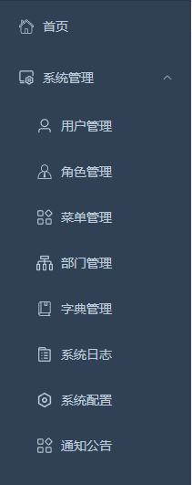

# API 接口文档

## 接口名：/rhino-wash-api/captchaImage

### 请求方式： GET

### 功能说明： 获取验证码图片

### 请求参数：

### 响应参数：
| 字段名 | 类型   | 说明       | 示例值                           |
| ------ | ------ | ---------- | -------------------------------- |
| img    | string | 验证码图片 | "/9j/4AAQSkZJRgABAQEASABIAAD..." |
| uuid   | string | 唯一标识符 | "123e4567-e89b-12d3-a            |

### 响应示例
{
    "msg": "操作成功",
    "img": "/9j/4AAQSkZJRgABAgAAAQABAAD/2wBDAAgGBgcGBQgHBwcJCQgKDBQNDAsLDBkS...",
    "code": 200,
    "captchaEnabled": true,
    "uuid": "b1a53c11eb084e25b822bd48a7492d76"
}

## 接口名：/rhino-wash-api/login

### 请求方式： POST

### 功能说明： 登录方法

### 请求参数：
| 字段名      | 类型   | 必填 | 说明       | 示例值                 |
| ----------- | ------ | ---- | ---------- | ---------------------- |
| username    | string | 是   | 用户名     |  "admin"             |
| password    | string | 是   | 密码       | "admin"              |
| code        | string | 是   | 验证码     | "123"                |
| uuid        | string | 是   | 唯一标识   | "b1a53c1"            |

### 响应参数：

| 字段名 | 类型   | 说明       | 示例值                           |
| ------ | ------ | ---------- | -------------------------------- |
| msg    | string | 验证码图片 | "操作成功" |
| code   | string | 唯一标识符 | 200                              |
| token  | string | 唯一标识符 | eyJhbGciOiJIUzUxMiJ9.eyJzdWIiOi  |

### 响应示例
{
    "msg": "操作成功",
    "code": 200,
    "token": "eyJhbGciOiJIUzUxMiJ9..."
}

## 接口名：/rhino-wash-api/getRouters

### 请求方式： GET

### 功能说明： 获取菜单路由

### 请求参数：Authorization token

### 响应参数：

| 字段名 | 类型   | 说明       | 示例值                           |
| ------ | ------ | ---------- | -------------------------------- |
| msg    | string | 验证码图片 | "操作成功"                        |
| code   | string | 状态码     | 200                              |
| data   | json   | 数据       | [{"name": "System"}]             |

### 响应示例
{
    "msg": "操作成功",
    "code": 200,
    "data": [
        {
            "name": "System",
            "path": "/system",
            "hidden": false,
            "redirect": "noRedirect",
            "component": "Layout",
            "alwaysShow": true,
            "meta": {
                "title": "系统管理",
                "icon": "system",
                "noCache": false,
                "link": null
                   }
         }
     ]
}

### 菜单效果图

## 接口名：/rhino-wash-api/getInfo

### 请求方式： GET

### 功能说明：获取用户信息

### 请求参数：Authorization token

### 响应参数：

| 字段名 | 类型   | 说明       | 示例值                            |
| ------ | ------ | ---------- | -------------------------------- |
| msg    | string | 验证码图片 | "操作成功"                        |
| code   | string | 状态码     | 200                              |
| sysMerchants   | JSON | 商家对象     | {}                     |
| sysMerchants.id   | int | 商家id     | 1                     |
| sysMerchants.merchantName   | String | 商家名称     | 小犀牛    |
| sysMerchants.description   | String | 商家描述     | 打造自助洗车 |
| sysMerchants.province   | String | 商家所属省份     | 江苏 |
| sysMerchants.city   | String | 商家所属市     | 苏州 |
| sysMerchants.district   | String | 商家所区     | 吴中区 |
| sysMerchants.address   | String | 商家详细地址     |郭新东路108号 |
| sysMerchants.bankName   | String | 商家银行     |中国银行 |
| sysMerchants.bankNum   | String | 商家银行账号     |3202626512510236257 |
| sysMerchants.totalRevenue   | decimal| 商家总收益     |100|
| sysMerchants.withdraw_money   | decimal| 商家可提现     |100|
| sysMerchants.servicePhone   | String | 商家客电话     |15998998000|
| sysMerchants.createTime   | date| 创建时间     |2024-06-29T16:11:14.000+08:00|
| sysMerchants.delFlag   | int| 删除标志：1正常0删除     |1|
| sysMerchants.state   | int| 状态：1正常运营0停运     |1|
|permissions   | array |用户权限     |*:*:*|
|roles   | array |用户角色     |admin|
|isDefaultModifyPwd   | boolean|检查初始密码是否提醒修改|false|
|isPasswordExpired   | boolean|检查密码是否过期     |false|
|user| JSON  |用户对象     |{}|
|user.createBy| String |创建人     |admin|
|user.createTime| date|创建时间     |2025-11-06 21:25:57|
|user.updateBy| String |修改人     |null|
|user.updateTime| date|修改时间     |null|
|user.remark| String |备注     |备注信息|
|user.userId| int |用户id     |1|
|user.deptId| int |部门id     |101|
|user.merchantId| int |商家id     |1|
|user.userName| String |用户名     |admin|
|user.nickName| String |昵称     |小犀牛|
|user.email| String |邮箱     |ry@163.com|
|user.phonenumber| String |手机号码     |15000000000|
|user.sex| String|性别     |（0男 1女 2未知|
|user.avatar| String|头像地址     |null|
|user.password| String|密码     |null|
|user.status| String|密码     |账号状态（1正常 0停用）|
|user.delFlag| String|密码     |账号状态（1正常 0停用）|
|user.loginIp| String|最后登录IP     |127.0.0.1|
|user.loginDate| String|最后登录时间    |2025-11-08T13:10:46.000+08:00|

