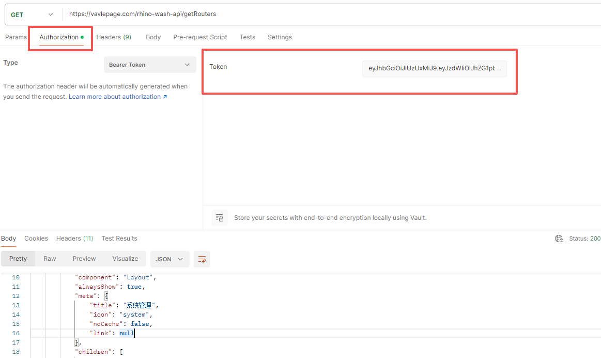

# API 接口文档

## 接口名：/rhino-wash-api/captchaImage

### 请求方式： GET

### 功能说明： 获取验证码图片

### 请求参数：

### 响应参数：
| 字段名 | 类型   | 说明       | 示例值                           |
| ------ | ------ | ---------- | -------------------------------- |
| img    | string | 验证码图片 | "/9j/4AAQSkZJRgABAQEASABIAAD..." |
| uuid   | string | 唯一标识符 | "123e4567-e89b-12d3-a            |

### 响应示例
{
    "msg": "操作成功",
    "img": "/9j/4AAQSkZJRgABAgAAAQABAAD/2wBDAAgGBgcGBQgHBwcJCQgKDBQNDAsLDBkS...",
    "code": 200,
    "captchaEnabled": true,
    "uuid": "b1a53c11eb084e25b822bd48a7492d76"
}

## 接口名：/rhino-wash-api/login

### 请求方式： POST

### 功能说明： 登录方法

### 请求参数：
| 字段名      | 类型   | 必填 | 说明       | 示例值                 |
| ----------- | ------ | ---- | ---------- | ---------------------- |
| username    | string | 是   | 用户名     |  "admin"             |
| password    | string | 是   | 密码       | "admin"              |
| code        | string | 是   | 验证码     | "123"                |
| uuid        | string | 是   | 唯一标识   | "b1a53c1"            |

### 响应参数：

| 字段名 | 类型   | 说明       | 示例值                           |
| ------ | ------ | ---------- | -------------------------------- |
| msg    | string | 验证码图片 | "操作成功" |
| code   | string | 唯一标识符 | 200                              |
| token  | string | 唯一标识符 | eyJhbGciOiJIUzUxMiJ9.eyJzdWIiOi  |

### 响应示例
{
    "msg": "操作成功",
    "code": 200,
    "token": "eyJhbGciOiJIUzUxMiJ9..."
}

## 接口名：/rhino-wash-api/getRouters

### 请求方式： GET

### 功能说明： 获取菜单路由

### 请求参数：Authorization token

### 响应参数：

| 字段名 | 类型   | 说明       | 示例值                           |
| ------ | ------ | ---------- | -------------------------------- |
| msg    | string | 验证码图片 | "操作成功"                        |
| code   | string | 状态码     | 200                              |
| data   | json   | 数据       | [{"name": "System"}]             |

### 响应示例
{
    "msg": "操作成功",
    "code": 200,
    "data": [
        {
            "name": "System",
            "path": "/system",
            "hidden": false,
            "redirect": "noRedirect",
            "component": "Layout",
            "alwaysShow": true,
            "meta": {
                "title": "系统管理",
                "icon": "system",
                "noCache": false,
                "link": null
                   }
         }
      ]
}